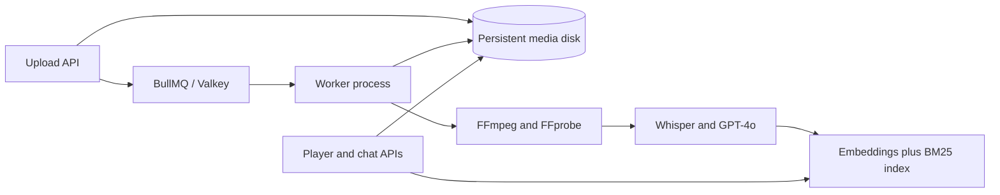

# ContextCast

ContextCast turns a video or audio file of up to 30 minutes into a timestamped media workspace: aligned transcript, grounded summary and chapters, ranked vertical clips, and chat that jumps back to its source moment.

**▶ Live demo:** https://ai-podcaster-eight.vercel.app/demo — a hosted, pre-processed sample workspace. No setup or API key required; runs in demo-analysis mode.

To exercise the full pipeline (real uploads, Whisper/GPT-4o, FFmpeg clipping), run it locally — see [Run locally](#run-locally). The hosted demo intentionally omits uploads because they need FFmpeg, a worker process, and persistent storage.

## Run locally

Prerequisites: Node.js 22+ and FFmpeg/FFprobe (`ffmpeg -version` to confirm). Redis is optional — without it, a safe in-process queue runs the worker inline.

```bash
git clone https://github.com/rajan1785/ai-podcaster.git
cd ai-podcaster
cp .env.example .env.local      # then add your OPENAI_API_KEY
npm install
npm run dev                     # http://localhost:3000
```

Open `http://localhost:3000`, upload a video, and the full pipeline runs end to end. With `OPENAI_API_KEY` set you get live Whisper/GPT-4o analysis; without it, files are still probed, converted, clipped, played, and indexed, with clearly labeled demo analysis.

## What is implemented

- Server-validated MP4, MOV, WebM, MP3, M4A, WAV, and OGG uploads up to 500 MB.
- FFprobe duration validation and FFmpeg audio extraction, frame sampling, and 9:16 clip rendering.
- Whisper transcription with word and segment timestamp granularities.
- GPT-4o multimodal analysis over transcript plus representative video frames.
- Structured chapter, summary, and viral-clip generation.
- Hybrid temporal retrieval: 65% OpenAI embeddings and 35% MiniSearch BM25-style keyword relevance.
- Context-scoped chat around a selected transcript moment, with clickable timestamp citations.
- BullMQ queue backed by Redis/Valkey, exponential retries, and a separately supervised worker process.
- Atomic, disk-backed job records and byte-range media streaming.
- A fully functional demo-analysis fallback when `OPENAI_API_KEY` is absent.

## Production-style local run

Run the production worker and web server together:

```bash
npm run build
npm run start:all
```

Run all verification:

```bash
npm run check
```

## Processing architecture



Job metadata is written atomically to `MEDIA_DATA_DIR`. Original media and rendered clips are served through authenticated-ready route handlers with HTTP byte-range support rather than directly from `public/`.

## Optional: production deployment (Render)

> Not required to run or demo ContextCast — the live demo above and the local run cover both. This section is for standing up an always-on hosted instance with the full upload pipeline, which needs a paid Render service (a persistent disk is unavailable on Render's free web tier).

The included `render.yaml` provisions:

- a Docker web service;
- a persistent 10 GB disk mounted at `/var/data`;
- a Render Key Value instance for BullMQ;
- a health check at `/api/health`.

Create a Render Blueprint from this repository, enter `OPENAI_API_KEY`, and apply it. The `starter` service is intentional because Render persistent disks are not available on the free web tier. The Docker image installs FFmpeg and starts Next.js and the worker as separate supervised processes.

For higher throughput, move the worker to a separate Render background service and replace disk storage with S3-compatible object storage so web and worker services can share media safely.

## API surface

- `POST /api/upload` — validate, persist, and enqueue media.
- `GET /api/job/:id` — progress and public result data.
- `GET /api/media/:id` — original media with Range support.
- `GET /api/clip/:id/:clipId` — generated vertical clip with Range support.
- `POST /api/chat` — scoped hybrid retrieval and grounded response.
- `GET /api/health` — deployment health check.

## Production notes

This submission keeps identity out of scope. Before a public multi-tenant launch, add authentication and job ownership checks, direct-to-object-storage uploads, rate limiting, content moderation, retention cleanup, observability, and a separate autoscaled worker service.
